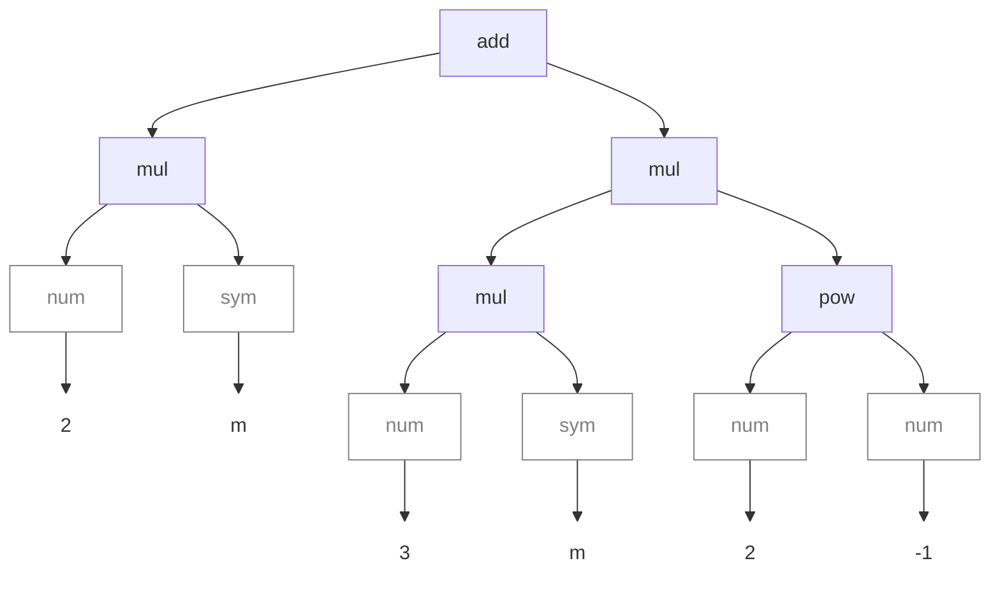
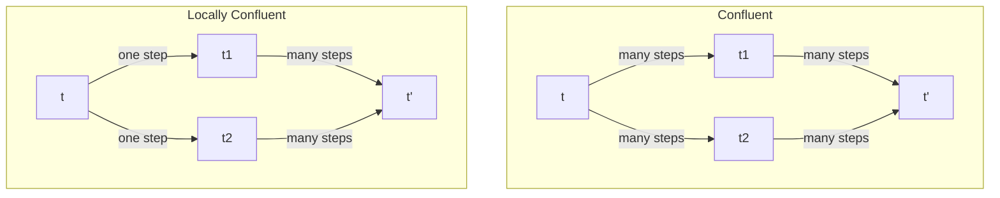

# Research <!-- omit in toc -->

> Note, the following document is intended to be viewed in Visual Studio Code
> with extensions for KaTex Math and the Mermaid diagram language

> Also Note: I'm no expert in this field, the notes below are probably subtly wrong in ways that I don't understand yet. Don't rely on them as accurate.

- [1. Sources](#1-sources)
- [2. Notation](#2-notation)
- [3. Terms](#3-terms)
	- [3.1. Definition](#31-definition)
	- [3.2. First Order Term](#32-first-order-term)
	- [3.3. Term Representation vs. Structure](#33-term-representation-vs-structure)
	- [3.4. Ordering of Terms by Complexity](#34-ordering-of-terms-by-complexity)
	- [3.5. Structural Equality of Terms (Literally Equal)](#35-structural-equality-of-terms-literally-equal)
	- [3.6. Notation used for Substitution](#36-notation-used-for-substitution)
- [4. Unification of Terms (Pattern Matching)](#4-unification-of-terms-pattern-matching)
	- [4.1. Subsumption (Instances Of)](#41-subsumption-instances-of)
	- [4.2. Subsumption Ordering](#42-subsumption-ordering)
	- [4.3. Intersection of terms](#43-intersection-of-terms)
- [5. Rewrite Rules](#5-rewrite-rules)
	- [5.1. Definition](#51-definition)
	- [5.2. Noetherian Rules](#52-noetherian-rules)
	- [5.3. Normal Form of a Term](#53-normal-form-of-a-term)
- [6. Proofing if Terms are Equivalent](#6-proofing-if-terms-are-equivalent)
	- [6.1. Word Problem](#61-word-problem)
	- [6.2. Rewrite Proof vs Non-Rewrite Proof](#62-rewrite-proof-vs-non-rewrite-proof)
- [7. Critical Terms](#7-critical-terms)
- [8. Superposition to find Critical Terms](#8-superposition-to-find-critical-terms)
- [9. Confluence](#9-confluence)
- [10. Canonical Rewrite Rules](#10-canonical-rewrite-rules)
- [11. Decision Procedure vs Semi Decision Procedure](#11-decision-procedure-vs-semi-decision-procedure)
- [12. Knuth-Bendix Completion Algorithm (KBC)](#12-knuth-bendix-completion-algorithm-kbc)
	- [12.1. Psudo-Code](#121-psudo-code)
	- [12.2. Possible Outcomes](#122-possible-outcomes)
	- [12.3. Limitations of KBC](#123-limitations-of-kbc)

## 1. Sources

Notes gathered (roughly) from this series of YouTube videos:
<https://www.youtube.com/watch?v=AP8L3OZxO-k>


## 2. Notation

| Notation                  | Meaning                                                            |
| ------------------------- | ------------------------------------------------------------------ |
| $\blue\implies$           | implies                                                            |
| $\blue\iff$               | if and only if                                                     |
| $t[x/y]$                  | Term $t$ but with all occurrences of $x$ replaced with $y$         |
| $\textcolor{orange}{>_r}$ | Operator which defines ordering of terms based on complexity       |
| $\textcolor{lime}{\ge_t}$ | Operator which defines ordering of terms based on subsumption      |
| $T$                       | The set of all valid terms                                         |
| $R$                       | The set of rewrite rules                                           |
| $Left(R)$                 | The set of all terms on the left hand side of rewrite rules in $R$ |

## 3. Terms

### 3.1. Definition

Terms in the software I am trying to write are fragments of algebra, like

$$2\cdot m + (3\cdot m)\cdot 2^{-1}$$

Given the following notation:

- Let $V$ be the set of variable symbols 
  - `["sym", _]`
- Let $C$ be the set of constant symbols
  - `["num", _]`
- Let $F_n$ be the sets of functions that can be applied to $n$ terms. In
  software these are normally called `operators`. Note that we will attempt to
  use only $F_1$ and $F_2$ to simplify our code:
  - $F_1$ would be `[["not",_],["neg",_], ...etc]`
  - $F_2$ would be `[["add",_,_], ["mul",_,_], ...etc]`)

Then the the set of (unsorted first-order) terms $T$ is recursively defined to be the smallest set with the following properties:
 - every variable symbol is a term: $V \sube T$,
 - every constant symbol is a term: $C \sube T$,
 - from every $n$ terms $t_1,\ \dots,\ t_n$, and every n-ary function symbol
   $f \isin F_n$, a larger term $f(t_1,\ \dots,\ t_n)$ can be built.

### 3.2. First Order Term

**??**

### 3.3. Term Representation vs. Structure

The pen-and-paper `representation` of terms sucks for writing algorithms:

$$2\cdot m + (3\cdot m)\cdot2^{-1}$$

Instead this term is parsed into a tree `structure` which can be expressed in JSON:

```javascript
[ "add",  ["mul", ["num",2], ["sym","m"]],  ["pow", ["num",2], ["num",-1]] ]
```

Or represented diagrammatically:



Note that brackets are a feature of the pen-and-paper
representation. They do not appear in the structure of the term.

### 3.4. Ordering of Terms by Complexity

**??** this is the Reduction Ordering?

Let the comparison operator $\textcolor{orange}{>_r}$ be defined to compare the
"complexity" between any two terms.

Complexity of a term can be measured by the number of leaf nodes in a tree:

```javascript
count_leaf(
    ["add", 1, ["add", 2, 3]]
);
//  =3
```

When terms have the same apparent complexity the leftmost subtree of each is
used to make further comparison:

```javascript
count_leaf(leftmost_subtree(["add", 1, ["add", 2, 3]]));
//  =1

count_leaf(leftmost_subtree(["add", ["add", 1, 2], 3]));
//  =2
```

### 3.5. Structural Equality of Terms (Literally Equal)

Terms are structurally equal if they share an exactly matching structure.
In other words, the JSON representations are 'deeply equal'.

**??** define an operator?

### 3.6. Notation used for Substitution

Terms can be transformed by the substitution of one term into another. For
example, given the following terms $t_1$, $t_2$, and $t_3$:

$$
\begin{aligned}
t_1 &= x + 1 \\
t_2 &= y^2 + 1 \\
t_3 &= y^2
\end{aligned}
$$

We can say that $t_1$ matches the term $t_2$ when $x$ is substituted for $t_3$
using the following notation:

$$
t_1[x/t_3] = t_2
$$

## 4. Unification of Terms (Pattern Matching)

Unification is the process of pattern matching terms by finding substitutions
that render both terms identical;

$$
(0 + a) + -a\enspace \green\leftrightarrow\enspace (x + y) + z \quad \blue\implies \quad 0 \green\leftrightarrow x,\enspace
a\green\leftrightarrow y,\enspace
-a\green\leftrightarrow z
$$

This feels very much like the `match` keyword in Rust, or the way that Haskell
works in general. Therefore, in my head, this is `Pattern Matching`.


### 4.1. Subsumption (Instances Of)

If two terms can be `unified` then the less general term is said to be an
`instance of` the more general term. Or phrased differently; the more general
term is said to `subsume` the less general term.

$$
t_a\ \text{is subsumed by}\ t_b \quad \blue\iff\ \quad t_b = t_a[t_c/x]\\[5mm]

\begin{aligned}
\text{where}\quad
&t_c\enspace\text{is some subterm of}\enspace t_a,\\
&x\enspace\text{is some subterm of}\enspace t_b,\ \text{and}\\
&t_a \textcolor{orange}{>_r} t_b \textcolor{orange}{>_r} t_c \textcolor{orange}{>_r} x
\end{aligned}
$$

> Note: **??** I am not sure about the last line of the where statement. I
> understand that to be the case, but this complexity ordering relationship was
> not explicit in the youtube video i got it from.


### 4.2. Subsumption Ordering

Let $\textcolor{lime}{\ge_t}$ be defined as the subsumption ordering such that

$$
t_a \textcolor{lime}{\ge_t} t_b \blue\iff t_a\ \text{is subsumed by}\ t_b
$$

Again:

- $t_b$ is the more general form of $t_a$
- $t_a$ can be expressed by substituting some other term ($t_c$ in the example above) into $t_b$
- $t_a$ is said to be an `instance` of $t_b$

### 4.3. Intersection of terms

Let the notation $t^*$ indicate the infinite set of terms that are `instances` of $t$
- For terms $t_1$ and $t_2$,
  - Let $t_3^*$ be the union $t_1^* \land t_2^*$
  - If the $t_3^*$ is not empty, then
    - both $t_1$ and $t_2$ can be applied to any term in $t_3^*$
    - $t_3$ is the most general form of $t_3^*$.
    - $t_3$ is a `critical term`.
  - Otherwise $t_1$ and $t_2$ are `unrelated`


## 5. Rewrite Rules

### 5.1. Definition

Let $R$ be a set of rewrite rules

$$
\begin{aligned}
l \xrightarrow{R_n} r
\\[5mm]
\text{where} \quad (\xrightarrow{R_n}) &\isin R \\
l &\isin T\\
r &\isin T
\end{aligned}
$$

- The application of any rule  must maintain equivalence, and
- the right side must be less 'complex' than the left side:
 

$$
l \xrightarrow{R_n} r
\quad \blue\iff \quad
l=r 
\quad \blue\iff \quad
l \textcolor{orange}{>_r} r
$$

> Note: In practical applications sometimes complexity is unchanged and this
> leads to awful nonsense.

### 5.2. Noetherian Rules

$R$ is `Noetherian` if it has the following 3 properties:

1. **Well Founded:** In every subset of $T$ there exists just one way to order
   elements according to complexity (as defined by the $\textcolor{orange}{>_r}$
   operator).
2. **Stable:** $t_a \textcolor{orange}{>_r} t_b \blue\implies t_a[t_c/x] \textcolor{orange}{>_r} t_b[t_c/x]$
   - eg: $x+y \textcolor{orange}{>_r} x \blue\implies (a+b)+y\textcolor{orange}{>_r} a+b \quad \text{where} \quad t_c=a+b$
3. **Monotonic:** $t_a \textcolor{orange}{>_r} t_b \blue\implies t_c[t_a/x] \textcolor{orange}{>_r} t_c[t_b/x]$
   - eg: $a+b \textcolor{orange}{>_r} a \blue\implies (a+b)+1 \textcolor{orange}{>_r} a+1\quad \text{where}\quad t_c=x+1$

If $R$ is `Noetherian`

- Replacement rules can only happen in the forward direction
  (otherwise the properties above aren't useful.)
- Therefore no new variables will be introduced during a replacement
- Complexity after each rewrite will decrease
- `Local Confluence` is the same as `Confluence`
- There are no infinite chains of rules

### 5.3. Normal Form of a Term

If a set of rewrite rules are successively applied to a term until no more rules
can be applied, then the term is said to be in `Normal Form`.

## 6. Proofing if Terms are Equivalent

### 6.1. Word Problem

The word problem is the problem of proofing that two sides of an equation
represent the same thing. For example, prove that the two sides of the following
are the same:

$$(x-1)(x+2) = x^2 + 3x - 3$$

### 6.2. Rewrite Proof vs Non-Rewrite Proof

If a proof can occur by applying rewrite rules only in the forward direction,
then it is called a `Rewrite Proof`.

If a proof requires that some rules are applied in reverse (increasing
complexity) followed by appling a different series of rules forwards again
(decreasing complexity) then this is said to be a `Non-Rewrite Proof`. In this
situation, the term of peak complexity is a `Critical Term`.

It is hard to write an algorithm which can do a `Non-Rewrite Proof`. Therefore
the goal is to generate a set of rewrite rules which are comprehensive enough to
eliminate the need for `Non-Rewrite Proofs`. To that end, finding
`Critical Terms` in the system is required.

## 7. Critical Terms

If a critical term is found to arise from a given $R$ then it is possible to
modify $R$ such that a `rewrite proof` is possible.

- Critical terms are an `instance` of two (or more?) terms in $Left(R)$
- Critical terms can be reduced to more than one `Normal Form` by distinct
  applications of the rewrite rules
- Critical terms are identified by `superposition` of terms in $Left(R)$.
  - Superposition of `first-order` terms will yield a single most general form.


## 8. Superposition to find Critical Terms

Superposition refers to the `unification` of two terms from $Left(R)$

Superposition of two rules can sometimes lead to the discovery of new rules.

- For every term $t$ in $Left(R)$
  - Apply all rules in $R$ to $t$
  - The list of resulting terms is $t'_{list}$ or $[t'_1,\ t'_2,\ \dots,\ t'_n]$
  - For each combination pair $(t_a,\ t_b)$ in $t'_{list}$
    - Attempt to solve the `word problem` by reducing both terms to normal form $NormalForm(t_a) = NormalForm(t_b)$
      - If successful
        - discard the result **??**
      - Otherwise
        - a new rewrite rule can be formed using
        $NormalForm(t_a)$ and $NormalForm(t_b)$ by arranging them in order of complexity.

Whenever a new rule is added, new superpositions can be considered which may lead to new rules.

## 9. Confluence

Confluence is related to the question of the existence of a `rewrite proof` for all `critical pairs`.
Can we keep adding rules until a `rewrite proof` is possible for all critical pairs?

- `Locally Confluent`
  - Means that all critical pairs have rewrite rules; no new rules need to be produced.
- `Confluent`
  - Whenever $t$ can be rewritten to more than one form (using zero or more steps) $t_1$ and $t_2$ then $t_1$ and $t_2$ have a rewrite proof.




- Adding rules by finding critical terms / pairs using superposition of terms in
  $Left(R)$ will get us a system that is `locally confluent`.
- Checking if a system is `confluent` must be done term by term and isn't really
  practical.
- However if $R$ is `noetherian` then `confluence` is equivalent to
  `local confluence`.

## 10. Canonical Rewrite Rules

The `cannonical` set of rewrite rules are both `noetherian` and `confluent`.
Every term has a unique `normal form`. This is called the `canonical representation` of the term.

If the rewrite rules are `canonical` then it can be used to test the validity of any theorem t1=t2 by reducing both terms to canonical form.

## 11. Decision Procedure vs Semi Decision Procedure

**??**

## 12. Knuth-Bendix Completion Algorithm (KBC)

### 12.1. Psudo-Code

The algorithm is:

- Let $A$ be the set of initial rewrite rules (Axioms)
- Let $R$ be the set of rewrite rules which is initially empty
- Select and remove an axiom from $A$
  - Normalise the selected axiom
  - If the normalised form of the axiom is not of the form $x=x$ then
    - Order the axiom using the reduction ordering $\textcolor{orange}{>_r}$ and
      introduce it into $R$
    - Superpose the new rule on all existing rules (including self) and
      introduce each critical pair into $A$

### 12.2. Possible Outcomes

The algorithm may do one of the following:

- Converge
  - Find a set of canonical rewrite rules
  - Can prove both validity and invalidity of equations
- Fail
  - If a particular axiom cannot be ordered by $\textcolor{orange}{>_r}$
  - For example the axiom $x \cdot y = y \cdot x$ cannot be ordered because
    first and second term have the same complexity.
    - To proceed in this case we must be able to do some extra complicated things:
      - We allow the rule to be applied in either direction provided that
         its instantiated form is orientable under $\textcolor{orange}{>_r}$
      - (or **??** and) Allow superposition on `Right(R)` in subsequent steps?
         Or is it just that we need to do this for the rules that we allow to be
         applicable in both directions?
- Diverge
  - The canonical set is infinite
  - May be used as semi decision procedure
    - Have to run the algorithm 'long enough' to generate the required rules
      for a given rewrite proof.
    - Invalid equations cannot be proven invalid

### 12.3. Limitations of KBC

1. Very hard to find a method of ordering $\textcolor{orange}{>_r}$ that suits particular needs.
2. In many practical cases the confluent set of rules is infinite.
3. Conditional axioms can generate meaningless terms.
   For example, in the following case a condition that $x\ne0$ must me added to $R_1$ to avoid introducing an erroneous rule:
$$
\begin{aligned}
&\text{Given  the axioms}\\
&\begin{aligned}
x^-1\cdot x\enspace &\xrightarrow{R_1}\enspace 1\\
x\cdot 0\enspace &\xrightarrow{R_2}\enspace 0\\
\end{aligned}\\
&\text{The following critical pair may be derived:}\\
&0^-1\cdot 0\quad\bigg\lbrace\quad\begin{aligned}
 &\xrightarrow{R_1}\enspace 1\\
&\xrightarrow{R_2}\enspace 0\\
\end{aligned}\\
\end{aligned}\\
$$
1. The KBC procedure is not goal directed. Generation of critical pairs is based on the rules formed. I am guessing it can generate large volumes of  redundant junk.
